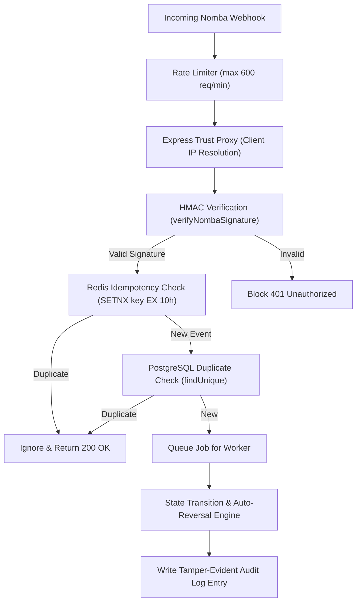

# Settl: Architecture & Security Note

This document outlines the security controls, integrity guarantees, and architectural patterns implemented in **Settl** to resolve the "debited but not credited" problem with absolute trust.

---

## System Overview & Security Pipeline

Settl sits as an infrastructure layer between Nomba's virtual account system and our backend services. Since Settl handles real money transfers, reversals, and ledger states, trust is our primary asset. The system uses a multi-layered security pipeline for every incoming webhook:

---

## 1. Webhook Authentication & Integrity (HMAC-SHA256)

To prevent attackers from sending fake webhook requests to credit virtual accounts or trigger illegitimate refunds, all incoming webhooks are validated using cryptographic signatures.

*   **Signature Algorithm:** We compute the HMAC using the **SHA-256** hashing algorithm.
*   **The Hashing Message (Colon-Matrix):** Nomba constructs the signature by joining specific fields of the transaction payload and the timestamp using colons (`:`). Settl reconstructs this payload string exactly in the signed order:
    $$\text{Payload} = \text{event\_type} : \text{requestId} : \text{userId} : \text{walletId} : \text{transactionId} : \text{type} : \text{time} : \text{responseCode} : \text{timestamp}$$
*   **Timing Attack Mitigation:** Simple string comparisons (`==`) are susceptible to timing attacks, where an attacker measures response times to guess signatures byte-by-byte. Settl uses Node's native `crypto.timingSafeEqual()` to perform constant-time comparisons of the calculated signature buffer and the received signature buffer.
*   **Replay Window Validation:** We enforce a strict **10-minute replay window** (with 30 seconds of clock skew tolerance). Webhooks arriving with timestamps older than 10 minutes are instantly discarded to prevent replay attacks.

---

## 2. Distributed Idempotency Engine (Anti-Double Payout Protection)

Idempotency guarantees that processing the same webhook multiple times has the same effect as processing it once. This is critical for preventing double-crediting or double-refunding transactions during network retries.

*   **Redis SETNX (Layer 1):** Webhooks are filtered at the application entry point using Redis. We attempt to store a key (`webhook:processed:${requestId}`) in Redis using the `SETNX` (Set if Not Exists) command with a **10-hour TTL (Time-To-Live)**. If Redis returns `null` (key already exists), the webhook is instantly discarded with a `200 OK` (telling Nomba we received it, so they stop retrying).
*   **PostgreSQL Unique Constraints (Layer 2):** In case of Redis connection issues (which fail open gracefully to maintain availability), we fall back to a database check. The `Transaction` table has a strict unique database index on the `merchantTxRef` field.
*   **Race Condition Mitigation:** Because the Redis `SETNX` operation is atomic, simultaneous duplicate webhook requests (arriving within milliseconds due to network retries) are safely deduplicated before hitting database resources.

---

## 3. Tamper-Evident Audit Log (Cryptographic Ledger)

Every critical action in Settl—such as transaction state changes or auto-reversal triggers—is written to a tamper-evident audit log. This provides cryptographic proof of actions in the event of a merchant dispute.

*   **Hash-Chain Architecture:** The audit log behaves like a blockchain. Each log entry contains a cryptographic signature (`hash`) that binds its own data to the signature of the previous entry:
    $$\text{Hash}_n = \text{SHA-256}(\text{sequenceNumber}_n + \text{eventType}_n + \text{JSON.stringify}(\text{payload}_n) + \text{Hash}_{n-1})$$
*   **Genesis Entry:** The first entry in the database (sequence number `1`) uses a fixed, hardcoded 256-bit seed as its `previousHash`.
*   **Strict Sequence Verification:** We provide a verification routine (`verifyAuditChain`) that walks the ledger sequentially. If any historical record is deleted, inserted, or modified, the hash of that block changes, breaking every subsequent block's `previousHash` link and exposing the alteration immediately.
*   **Write Atomicity:** The `appendAuditEntry` function takes the Prisma transaction client and runs within the same database transaction as the state transition. This guarantees that a state change cannot succeed without its corresponding audit log entry being successfully sealed.

---

## 4. Operational Defenses & Secrets Management

*   **Rate Limiting:** Webhook paths are protected by an `express-rate-limit` rule allowing up to **600 requests per minute** (10/sec). This mitigates denial-of-service (DDoS) spikes and protects the cryptographic parsing layer from CPU exhaustion.
*   **Proxy Configuration:** The Express server is configured with `app.set('trust proxy', 1)`. This ensures that when deployed behind reverse proxies or load balancers (like Render or Cloudflare), the rate limiter reads the actual client IP, preventing a global block of your load balancer's internal IP.
*   **Secrets Isolation:** All sensitive credentials—including database connection strings, Redis credentials, and Nomba API secrets—are strictly isolated in the `.env` file (which is git-ignored). No production credentials or sandbox keys are hardcoded in the codebase.
